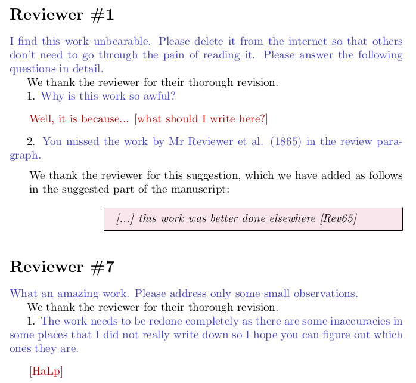

# Latex package "review"
Minimal latex package for a hassle free reviewing process (beyond the review itself anyway). To use, just put the `review.sty` package next to your `main.tex` and import it with 

    \usepackage{review}

If you don't feel like downloading the file from your browser (I wouldn't), then you can just download the raw file:

    wget https://raw.githubusercontent.com/nabw/review-latex/main/review.sty

Usage is very simple, use this fictitous but scarily accurate work-in-progress review as an example: 

    \documentclass{article}
    \usepackage{review}
    \begin{document}
    \section*{Reviewer \#1}

    \reviewer{I find this work unbearable. Please delete it from the internet so that others don't need to go through the pain of reading it. Please answer the following questions in detail.}

    We thank the reviewer for their thorough revision.

    \question{Why is this work so awful?}

    % Work in progress answers are red
    \answerWIP{Well, it is because... [what should I write here?]}

    \question{You missed the work by Mr Reviewer et al. (1865) in the review paragraph.}

    % Done answers are denoted as so in the code for readability
    \answerDone{We thank the reviewer for this suggestion, which we have added as follows in the suggested part of the manuscript:

      % You get a framed minipage for in-work quotes if you want.
      \citeinwork{ [...] this work was better done elsewhere [Rev65] }

    }

    \section*{Reviewer \#7}
    \reviewer{What an amazing work. Please address only some small observations.}
    % Reset the questions counter if you want them to start from 1 again

    We thank the reviewer for their thorough revision.
    \resetReviewCounter
    \question{The work needs to be redone completely as there are some inaccuracies in some places that I did not really write down so I hope you can figure out which ones they are.}

    \answerWIP{[HaLp]}

    \end{document}

Which is rendered into the following:

